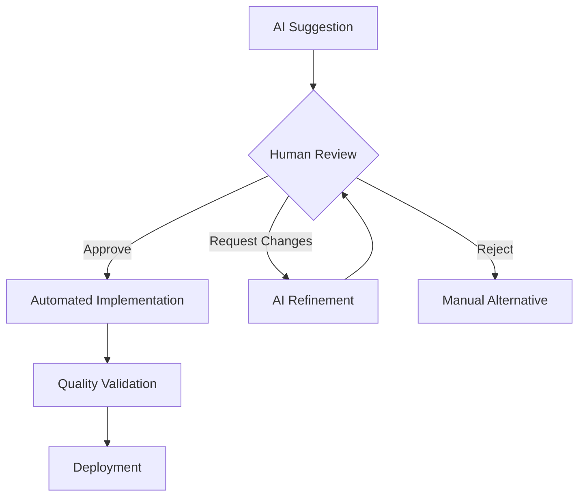

# Platform Features Overview

The AI Code Development Platform provides comprehensive tools and capabilities to transform your development workflow. Here's what makes our platform unique and powerful.

## Core Platform Capabilities

### 🤖 AI Agent Orchestration

Our multi-agent system coordinates intelligent automation across your entire development lifecycle.

  

    <h3>🎯 Project Manager Agent</h3>
    <ul>
      <li>Automated sprint planning and task breakdown</li>
      <li>Intelligent story point estimation</li>
      <li>Dependency tracking and bottleneck identification</li>
      <li>Progress monitoring and reporting</li>
      <li>Risk assessment and mitigation planning</li>
    </ul>
  

  
  

    <h3>💻 Developer Agent</h3>
    <ul>
      <li>Context-aware code generation</li>
      <li>Automated refactoring and optimization</li>
      <li>Bug detection and fixing suggestions</li>
      <li>Code review and quality analysis</li>
      <li>Documentation generation</li>
    </ul>
  

  
  

    <h3>🔍 Quality Assurance Agent</h3>
    <ul>
      <li>Automated test generation and execution</li>
      <li>Performance monitoring and analysis</li>
      <li>Security vulnerability scanning</li>
      <li>Code coverage tracking</li>
      <li>Quality metrics and reporting</li>
    </ul>
  

  
  

    <h3>🚀 DevOps Agent</h3>
    <ul>
      <li>CI/CD pipeline automation</li>
      <li>Infrastructure management</li>
      <li>Deployment monitoring</li>
      <li>Environment configuration</li>
      <li>Scaling recommendations</li>
    </ul>
  

[Learn More →](ai-orchestration.md)

### 🎯 Human-in-the-Loop Controls

Maintain full control over critical decisions while leveraging AI automation for efficiency.

#### Decision Points

- **Architecture Reviews**: AI proposes, you approve major architectural decisions
- **Feature Specifications**: Collaborative refinement of requirements and implementations
- **Code Quality Gates**: Human validation of generated code before integration
- **Security Approvals**: Manual review of security-sensitive changes
- **Deployment Decisions**: Strategic control over when and how releases happen

#### Control Mechanisms

[Learn More →](human-controls.md)

### 🌐 Cross-Platform Development

Build applications for multiple platforms from a single codebase and workflow.

#### Supported Platforms

=== "📱 Mobile (Android Priority)"
    - **Native Android**: Kotlin/Java with Jetpack Compose
    - **Cross-Platform**: Flutter and React Native support
    - **Progressive Web Apps**: Mobile-optimized web applications
    - **Hybrid Apps**: Cordova and Ionic frameworks

=== "🌐 Web Applications"
    - **React**: Modern React with TypeScript
    - **Vue.js**: Vue 3 with Composition API
    - **Angular**: Latest Angular with TypeScript
    - **Next.js**: Full-stack React applications

=== "🖥️ Desktop Applications"
    - **Electron**: Cross-platform desktop apps
    - **Tauri**: Lightweight native applications
    - **Native**: Platform-specific native development
    - **Progressive Web Apps**: Desktop PWA support

#### Shared Components

- **Design System**: Consistent UI components across platforms
- **Business Logic**: Shared services and state management
- **API Integration**: Unified data access layer
- **Testing Suite**: Cross-platform test automation

[Learn More →](cross-platform.md)

## Advanced Features

### 📊 Intelligent Analytics & Insights

Gain deep understanding of your development process and team performance.

#### Development Metrics
- **Velocity Tracking**: Sprint velocity trends and predictions
- **Code Quality Metrics**: Technical debt, complexity, and maintainability
- **Team Performance**: Individual and team productivity insights
- **Bottleneck Analysis**: Identify and resolve development blockers

#### Predictive Analytics
- **Delivery Forecasting**: AI-powered delivery date predictions
- **Risk Assessment**: Early warning system for project risks
- **Resource Planning**: Optimal resource allocation suggestions
- **Quality Predictions**: Proactive quality issue identification

### 🔒 Enterprise Security & Compliance

Built-in security features meet enterprise standards and compliance requirements.

#### Security Features
- **Code Security Scanning**: Automated vulnerability detection
- **Dependency Management**: Security monitoring for third-party packages
- **Access Controls**: Role-based permissions and audit trails
- **Data Encryption**: End-to-end encryption for sensitive data

#### Compliance Support
- **SOC 2 Compliance**: Security and availability controls
- **GDPR Compliance**: Data protection and privacy controls
- **HIPAA Support**: Healthcare data protection features
- **Custom Compliance**: Configurable compliance frameworks

### 🔄 Agile Workflow Integration

Seamlessly integrate with your existing agile processes and tools.

#### Methodology Support
- **Scrum**: Complete Scrum framework support with AI enhancements
- **Kanban**: Visual workflow management with intelligent insights
- **SAFe**: Scaled Agile Framework integration for enterprise teams
- **Custom**: Flexible workflow configuration for unique processes

#### Tool Integrations
- **GitHub**: Native integration with GitHub Projects and Issues
- **Jira**: Bi-directional sync with Atlassian Jira
- **Azure DevOps**: Complete Azure DevOps integration
- **Slack/Teams**: Real-time notifications and collaboration

## Feature Comparison by Plan

| Feature Category | Free | Developer | Team | Enterprise |
|------------------|------|-----------|------|------------|
| **AI Generations/Month** | 50 | 500 | Unlimited | Unlimited |
| **Projects** | 5 | Unlimited | Unlimited | Unlimited |
| **Team Members** | 1 | 1 | 10 | Unlimited |
| **Cross-Platform Support** | ✅ | ✅ | ✅ | ✅ |
| **GitHub Integration** | Basic | Full | Full | Enterprise |
| **Advanced Analytics** | ❌ | Basic | Full | Enterprise |
| **Priority Support** | ❌ | ❌ | ✅ | ✅ |
| **Custom Integrations** | ❌ | ❌ | Limited | Unlimited |
| **Security Features** | Basic | Enhanced | Advanced | Enterprise |
| **Compliance Tools** | ❌ | ❌ | Basic | Full |

## Performance & Scalability

### Response Times
- **Code Generation**: < 5 seconds for typical components
- **Project Analysis**: < 30 seconds for medium projects
- **Build & Deploy**: 2-10 minutes depending on complexity

### Scalability Limits
- **Concurrent Users**: Up to 10,000 per enterprise instance
- **Project Size**: No hard limits, optimized for projects up to 1M LOC
- **API Rate Limits**: Generous limits with burst capacity

## Getting Started with Features

### Feature Discovery Path

1. **Start Simple**: Begin with basic code generation and GitHub integration
2. **Add Intelligence**: Enable AI agents and automated workflows  
3. **Scale Up**: Add team collaboration and advanced analytics
4. **Go Enterprise**: Implement security, compliance, and custom integrations

### Feature Activation

Most features are automatically available based on your subscription tier. Some enterprise features require configuration:

- **SSO Integration**: Contact support for SAML/OAuth setup
- **Custom Compliance**: Work with our team to configure requirements
- **Dedicated Infrastructure**: Available for enterprise customers

## Feature Roadmap

### Coming Soon (Q1 2025)
- **Mobile App**: Native mobile apps for iOS and Android
- **Offline Mode**: Local development capabilities
- **Advanced Debugging**: AI-powered debugging assistance

### Future Releases (2025)
- **Multi-Language Support**: Python, Go, and other language support
- **AI Model Selection**: Choose from multiple AI providers
- **Advanced Automation**: Complete CI/CD pipeline generation

## Need Help with Features?

- **📖 Feature Guides**: Detailed documentation for each feature
- **🎥 Video Tutorials**: Step-by-step feature walkthroughs
- **💬 Community**: Ask questions in our developer community
- **🎯 Training**: Free feature training sessions

Ready to explore specific features? Check out our detailed guides:

- [AI Agent Orchestration](ai-orchestration.md)
- [Cross-Platform Development](cross-platform.md)
- [Agile Workflow Automation](agile-workflows.md)
- [Human-in-the-Loop Controls](human-controls.md)

---

*Have questions about features or need help choosing the right plan? [Contact our team](../support/contact.md) for personalized guidance.*